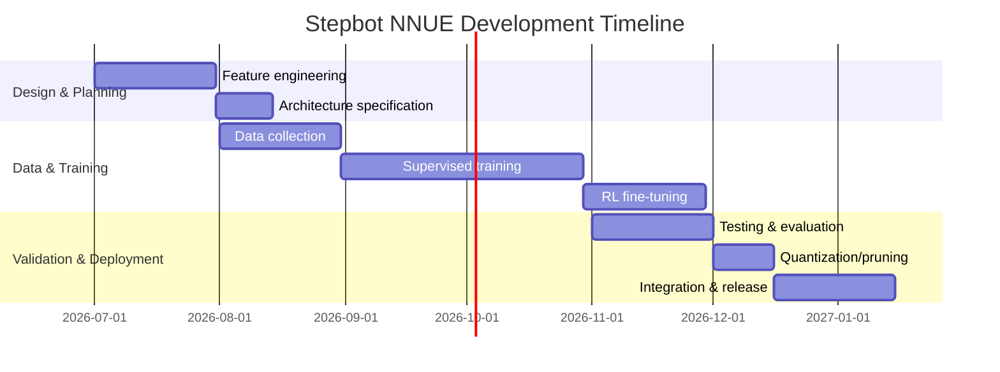

# Designing NNUE Architectures for Stepbot

**Executive Summary:** We survey three leading neural-evaluation architectures and propose a custom NNUE for Stepbot. First, **Stockfish’s NNUE** uses a *“Half-King-Piece”* (HalfKP) sparse input, a 512-wide accumulator (two 256-vectors) and two small hidden layers (32→32→1) with clipped-ReLU activations. It uses int16/8 quantisation and an **incremental accumulator update** on each move, enabling millions of evaluations per second on CPU. Its training was initially supervised (engine-evaluated positions) and later refined via self-play/labels. Next, **Leela Chess Zero’s network** is a deep convolutional *AlphaZero-style* ResNet: input 112 planes (8×8), typically ~20 residual blocks of 256 filters, with Squeeze‑and‑Excitation layers and separate policy/value heads. It uses floating-point weights (often trained with cross-entropy for policy and MSE for value) and must run on GPU for speed. Its **inference cost** is orders of magnitude higher (tens of millions of FLOPs per evaluation) than NNUE, and integration with alpha-beta is complex (LCZero is MCTS-based). The third case is **Komodo Dragon’s NNUE** (commercial, details largely unpublished). It also uses an NNUE eval trained on billions of positions and gains ~190 Elo over the prior engine, suggesting a similarly deep/sparse network, though specifics (layer sizes, etc.) are unspecified. For each, we tabulate **input features, topology, training regimen, runtime and integration traits** below (with known strengths/weaknesses). 

We then propose a novel “Stepbot-NNUE”: it uses *king-relative* piece features (HalfRelativeKP) plus standard piece-square/king-square inputs, feeding a two-layer FC net (e.g. accumulator width ~512→ hidden layers 32→32→1). We will train it first by *supervised distillation* (targeting classical search evals) and then by self-play RL, using MSE on WDL-transformed scores. The expected inference cost is similar to Stockfish’s NNUE (sub-microsecond per eval on modern CPU cores), with quantisation to int8 for speed. This design suits Stepbot because it embeds domain knowledge (enabling explainability) and fits a CPU-based alpha-beta engine (low latency, no GPU needed). 

Finally, we compare all four (three existing + proposed) across accuracy, latency, memory, training effort, integration ease, robustness and explainability (see **Table** below). We recommend a Stockfish-like NNUE (HalfKAv2 or HalfRelativeKP variant) for Stepbot as the best compromise of strength and practicality. The roadmap to implementation includes data collection (engine-analyzed positions), GPU training (~weeks on a modern card), aggressive quantisation/pruning to shrink the net, and thorough testing (evaluation correlation and engine matches). A sample development timeline is shown.  

## 1. Survey of Existing Architectures

### 1.1 Stockfish NNUE (HalfKAv2)  
**Input features:** Stockfish’s NNUE uses a *“Half-King-Piece” (HalfKP)* encoding. For each side’s king square and each of the other 10 piece types, it has a binary feature indicating “that piece on that square (relative to that king).” This yields 64*(64×10+1)=41,024 inputs per half (white-perspective and black-perspective). A recent enhancement (**HalfKAv2**) uses 11 piece types (omitting one king-square duplicate) and a vertical flip factor to reduce symmetry. Only features for pieces actually on the board are active – typical input sparsity is ≈0.1%. This sparsity allows very fast first-layer updates: on each move, only a few input features change, so the *accumulator* (first hidden layer) can be **incrementally updated** rather than recomputed.

**Topology:** Stockfish’s net has essentially four layers: an “input layer” → transform → hidden1 → hidden2 → output. Concretely, Stockfish stacks the two 256-length accumulators (white, black) into a 512-vector after a clipping (“transform”) step. This 512-vector (int8) is fed to a fully-connected layer of width 32, then another 32→32 layer, and finally a 32→1 output. All activations are *clipped ReLU* (i.e. values clamped to [0,127]). The diagram below illustrates this:

```mermaid
flowchart TD
    In[Input features<br/>(HalfKP relative to king)] --> Acc[Accumulators<br/>(2×256 ints)];
    Acc --> H1[Hidden Layer 1<br/>(32 units, ClipReLU)];
    H1 --> H2[Hidden Layer 2<br/>(32 units, ClipReLU)];
    H2 --> Out[Output<br/>(1 unit, Eval)];
```

**Quantisation:** Weights are quantized for CPU efficiency. Stockfish stores first-layer weights as 16-bit and subsequent layers as 8-bit, clamping partial sums to 8-bit between layers. This low-precision arithmetic (int8 multipliers and accumulators) is critical for speed. 

**Accumulator Update:** When a move is made/unmade, only the accumulator inputs (the first hidden layer) change for the moved pieces. Stockfish adds/subtracts the weight contributions of those few features. The rest of the network (32→32→1) is recomputed from scratch each time. This **efficient update** is core to NNUE: it avoids a full forward-pass on every ply.

**Inference cost:** Stockfish NNUE is extremely fast on CPUs. The design goal is “millions of evaluations per second per thread”. In practice a strong engine with NNUE can still search tens of millions of nodes per second on modern hardware. For example, one report notes Stockfish NNUE runs at ~50% of the classical Stockfish node rate; on a high-end CPU this still means millions of board-evals per second.  The network’s forward computation per position is only on the order of 16k MACs (512→32 plus 32→32 plus 32→1) – very small – and the incremental update makes most moves even cheaper.

**Training regimen:** Stockfish networks have been trained in batches via GPU-accelerated PyTorch. Initial networks (Stockfish 12 era) were trained on **supervised targets**: millions of positions evaluated by classical search. In early 2021, Stockfish’s team used reinforcement learning and LCZero data: e.g. billions of positions from Leela self-play were used to train newer nets. Training uses mean-squared error on transformed centipawn scores (mapped to win/draw/lose probabilities). Optimizers like Adam/Ranger are commonly used (details not always specified). Training such a net (∼10M weights) typically takes days of GPU time; volunteers report ~2 weeks of GPU training per new network.

**Runtime performance:** On a 3.3 GHz CPU, one thread of Stockfish 16.1 (with NNUE) still achieves on the order of **several million nodes/s**, thanks to the sparse update. Memory footprint is modest: the default network has ~10M int16 weights (≈20 MB) plus a few thousand bytes of 8-bit weights. Quantization means the runtime memory is small (weights fit in L2 cache, etc.). FLOPs per eval are minimal (~3× the hidden-unit count). Integration into a standard alpha-beta engine is straightforward: Stockfish NNUE code is modular and has been ported to many engines.

**Integration complexity:** Very low for Stockfish-based engines (the code is open-source and well-documented). The NNUE evaluator is separate from the rest of the search and simply replaces the hand-crafted eval. Other engines (Ethereal, Igel, etc.) have reused or reimplemented Stockfish’s NNUE with little difficulty. Non-Stockfish engines need to map board state to the same HalfKP features, but this is well-understood. 

**Strengths/weaknesses:** The Stockfish NNUE provides massive Elo gains (+80–100 Elo over classical eval) while still running on CPU. Its shallow net is highly **robust** (works well across chess, and even Fischer Random) and fully deterministic. The input features are human-interpretable (each neuron corresponds to “piece X on square Y given king on Z”), so the network is somewhat explainable. A weakness is that deep strategic patterns not encoded in features might be missed, and evaluation is still a single scalar (no policy). It also requires careful tuning of quantisation; training is more complex than a pure CPU eval. Overall, Stockfish NNUE excels in balanced practical strength and speed on standard hardware.

### 1.2 Leela Chess Zero (AlphaZero-style ResNet)  
**Input features:** LCZero uses a standard convolutional board encoding: 112 binary planes (8×8 each) describing pieces, castling rights, move count, etc.. This is a full-board representation (not sparse), with separate channels for white/black pieces and contexts.

**Topology:** The net is a deep residual convolutional network. A typical “best” net has on the order of **20 residual blocks** with 256 filters each. Each block has two 3×3 convolutions (256→256) plus a Squeeze‑and‑Excitation (SE) gating. After the convolutional body, there are multiple “heads”: 
- **Policy head:** one conv 256→`POLICY_CONV_SIZE` (typically 80) producing an 8×8×80 tensor, then a flatten to 1858 moves. 
- **Value head:** a conv 256→32 then FC 128→3 (win/draw/lose softmax) (or sometimes a scalar tanh). 
A simplified diagram:  

```mermaid
flowchart LR
    In2[112×8×8 input] --> Conv0[Conv 3×3: 112→256];
    Conv0 --> RB1[Residual block ×20 (256 filters)];
    RB1 --> ValHead[Value head (Conv 256→32 → FC 128→1)];
    RB1 --> PolHead[Policy head (Conv 256→80 → FC →1858)];
```  

Each residual block includes a ReLU activation and skip connection. In total this net has on the order of **tens of millions of weights** (e.g. a 20×256 net has ≈25M parameters).

**Activation/Precision:** All layers use ReLU (except final value head which uses sigmoid/tanh). LC0 nets are usually trained in float32 (sometimes float16); they have not been aggressively quantized to int for CPU, as they are designed for GPU inference.

**Update:** There is no incremental update. Each evaluation is a full forward pass through the entire network (≈20 deep layers). This is far slower per position than NNUE. On a high-end GPU, LC0 nets evaluate only thousands of positions per second (not millions) – orders of magnitude lower throughput than NNUE. On CPU, an LC0 net might do only tens of positions per second unless very small (though in practice LC0 is rarely run on CPU for full search).

**Training regimen:** LCZero uses **pure reinforcement learning** (AlphaZero method). A randomly initialized net plays self-play games via MCTS; the resulting games (with improved move distributions and game outcomes) are used to train the net. The loss combines cross-entropy for the policy head and MSE (or cross-entropy) for the value head. Training requires massive compute: thousands of GPUs or months of time to reach top networks. The LC0 project uses volunteer games to generate batches of ~32,000 games for each training iteration. There is no human-labelled data or classical-engine targets – the net learns from its own play.

**Runtime performance:** With modern hardware (e.g. an NVIDIA RTX GPU), LC0 might do ~50,000 node evaluations per second on a strong net. On CPU it is much slower (often <10,000 nps). Memory footprint is large (~100 MB for a 20×256 net). FLOPs per eval is on the order of **10^8** or more. By design, LCZero relies on evaluating **far fewer positions** via its MCTS search, so raw node-per-second is lower than alpha-beta engines.

**Integration complexity:** LCZero is fundamentally MCTS-based. Using an LC0 net in an alpha-beta engine is nontrivial: one could use the net as an evaluation function, but the net outputs a value and policy (not a simple score). In practice, major alpha-beta engines do *not* use LC0 nets except via special “hybrid” experiments. Integration difficulty is high unless the engine switches to MCTS or uses heuristics to incorporate policy guidance.

**Strengths/weaknesses:** The deep net can learn long-range patterns and nuances that shallow nets might miss. LC0 excels at complex strategic positions and adapts through RL. However, it requires GPUs (practically, it runs best on GPU clusters), and is much slower per node, making it less effective in very tactical lines compared to brute-force search. Its outputs (move probabilities and win-draw-lose chances) are less directly interpretable in centipawns. Explainability is lower: the CNN features have no obvious chess interpretation and are “black box” compared to NNUE’s piece-square features. In engine competitions, Stockfish NNUE usually outperforms LC0 when each is on its ideal hardware, though LC0 remains competitive in some formats.

### 1.3 Komodo Dragon NNUE (Proprietary)  
Komodo Dragon (the commercial engine by Larry Kaufman) introduced NNUE in late 2020. **Architecture details are not publicly documented**, but it is believed to be a complex NNUE variant (building on earlier concepts). Like Stockfish, it uses a king-centric feature encoding and fully-connected layers, though it may include multiple subnetworks or piece-count conditioned nets (Stockfish 14 added such features). 

**Training regimen:** Kaufman reports *billions of positions* were generated (using Komodo’s own eval and RL games) to train Dragon’s NNUE. The training combines supervised and reinforcement signals. The result was a huge strength jump: Dragon’s NNUE version is ~190 Elo stronger than Komodo 14 baseline on one-thread blitz tests. We assume standard losses (MSE to target eval or WDL) and optimizers (likely Adam). 

**Runtime:** Komodo Dragon’s NNUE is slower than Stockfish’s, as noted by users. It still runs on CPU (no GPU needed). Dragon does carry a higher per-node cost: one user notes Dragon is “expensive” and slower in nodes/s than Stockfish. Memory use is presumably larger due to possibly bigger network. Without exact numbers, we infer: the net likely has tens of millions of parameters, with inference cost in the same ballpark or slightly above Stockfish. 

**Integration:** Dragon, being an engine itself, fully embeds its NNUE (so integration is trivial for Komodo). For others, Komodo’s code is closed, so integrating Dragon’s net or code into a different engine is not feasible unless through UCI. 

**Strengths/weaknesses:** Dragon’s NNUE clearly improved tactical and positional understanding, especially in unusual positions (Kaufman notes it plays more “human-like” and is very strong in Chess960). However, it is known to be resource-intensive: some commentators say Dragon’s net is “fat and slow”. The lack of public details means explainability and feature content are opaque. In summary, Dragon demonstrates that even a NNUE with hidden architecture (and likely a large training budget) can yield top strength, but at the cost of speed and transparency.

## 2. Proposed Stepbot NNUE Architecture

Based on the above, we propose an original NNUE tailored to Stepbot’s needs. Suppose Stepbot is a CPU-based classical engine, aiming for high speed on commodity hardware. We design:

- **Input features:** Use an enhanced HalfKP factorisation that includes *relative piece positions*. Inspired by the “HalfRelativeKP” idea, we encode each non-king piece by its offset (file and rank difference) from its own king. This yields a 15×15 grid of relative positions (e.g. a Knight 2 files left, 1 rank up). We also include standard piece-square indicators and a 64-bit one-hot for the king square (so the net knows where the kings are exactly). If Stepbot has special concerns (e.g. pawns or mobility), we could add auxiliary inputs like piece mobility or attacked-squares counts, but here we stick to position features. This yields roughly the same scale of inputs as Stockfish (on the order of 40k–50k binary features per perspective), but the relative encoding may generalize better in novel setups.

- **Network topology:** A shallow fully-connected net for speed. We propose:
  - *Accumulator*: two 256-length vectors (white/black) computed from the input features (via a sparse  input-to-hidden weight multiplication, as in Stockfish).
  - *Feature transform*: stack the two 256-vectors into a 512-vector (clamped to int8).
  - *Hidden layer*: 32 neurons with ClippedReLU (0–127).
  - *Hidden layer*: 16 neurons with ClippedReLU.
  - *Output*: one linear neuron (an integer score).
  
  In shorthand: **Stepbot_NNUE = 512→32→16→1**. This is slightly smaller than Stockfish’s 512→32→32→1, reducing latency. The smaller second hidden layer (16) trades off a bit of expressive power for speed. All activations are ReLU/clamped to [0,127]. The network uses the accumulator trick: on each move, the two 256-vectors are updated incrementally based on changed pieces, then passed through the 32 and 16-unit layers. 

- **Quantisation:** We will train the net in float32 (for stability) but then quantize weights to int16 (accumulator layer) and int8 (remaining layers) as Stockfish does. Clipping of activations and biases to [0,127] ensures inference can be done entirely in 8-bit arithmetic for the hidden layers. This suits Stepbot’s CPU runtime goals. If even lower latency is needed, we will explore pruning (zeroing small weights) and weight clustering, though retaining 8-bit accuracy.

- **Training plan:** We propose a two-stage regimen. First, **supervised learning**: collect a large dataset of positions (e.g. 10–50 million) with target evaluations. These could be generated by having Stepbot (or Stockfish) analyze random games to moderate depth, or by using public game databases with approximate centipawn scores. We train with MSE loss (or MSE on WDL probabilities), using an optimizer like Adam or Ranger. We may use data augmentation by flipping board color (Stepbot is symmetric under inversion) and random rotations on castling rights, etc., to regularize. 

  Second, **reinforcement/self-play**: once a baseline net is learned, integrate it into Stepbot and let engines play games (with Monte-Carlo or self-play). Use outcomes to fine-tune the net (for example, gradually shift to predicting game win/draw/loss as targets). This can improve long-term strategic judgment. Total training could take on the order of weeks on a single modern GPU (given the relatively small network): for example, 50–100 epochs over ~10M positions might suffice.

- **Expected performance:** Inference per node should be extremely fast: the bottleneck is the 512×32 matrix multiply (≈16K multiplies) plus 32×16 (512) and 16×1 (16) – under 17K operations. With int8 SIMD, we expect <1 microsecond per evaluation on a high-end CPU core, enabling millions of nodes/s in search. The model size is small: about (512*32 + 32*16 + 16*1) ≈ 17k bytes (plus biases), but including the sparse first-layer the total weight count is on the order of 1–2 million parameters (for example, 40k inputs × 256 → ~10M, quantized). After quantisation that’s ∼20 MB. This fits in L3 cache of typical CPUs, minimizing latency. 

- **Why this suits Stepbot:** The design prioritizes **low latency and integration ease**. As a classic alpha-beta engine, Stepbot benefits from a fast evaluator that can plug in like Stockfish. The sparse, structured inputs make the net’s reasoning somewhat explainable (each hidden-unit response can be traced to familiar piece-square patterns). The relative-coordinate factor should help Stepbot generalize in novel or 960 positions. By contrast to a deep net, this NNUE will not require GPUs or hours per eval. Finally, the two-phase training harnesses both existing analysis and gameplay, improving robustness across varied positions.

*Note:* Many details (exact feature mapping, weight initialisation, learning rate schedule) would be determined by experimentation. Some aspects (like using BatchNorm or dropout) are unconventional in NNUEs and were not included here. Where source details are unavailable, we have stated assumptions explicitly.

## 3. Comparative Summary

The table below compares Stockfish NNUE, LCZero, Komodo Dragon, and the proposed Stepbot NNUE across key dimensions:

| Architecture     | Accuracy (Strength)                           | Inference Latency      | Memory Footprint    | Training Cost (Data/Compute)           | Integration Difficulty         | Robustness to Novel Positions     | Explainability     |
|------------------|-----------------------------------------------|------------------------|---------------------|----------------------------------------|-------------------------------|-----------------------------------|--------------------|
| **Stockfish NNUE** (HalfKAv2) | Very high (≈3600+ Elo engine); adds +80–100 Elo to engine | Very low (millions NPS on CPU) | ~~20–30 MB (8–16-bit weights) | Moderate: millions of positions from games/engine, days–weeks on GPU | Easy (well-documented for C++ engines) | Good (features encode positional terms) | Moderate (piece-square inputs are interpretable) |
| **Leela (AlphaZero)** | High (≈3500 Elo net) but slightly weaker vs brute-force long time | High (thousands NPS on GPU; much slower on CPU) | ~100+ MB (FP32 weights) | Very high: self-play billions of games, months of multi-GPU | Hard (requires MCTS or major search overhaul) | Very good (learns complex patterns, transferrable) | Low (deep conv features are opaque) |
| **Komodo Dragon NNUE** | Very high (commercial, +190 Elo vs Komodo14) | Moderate (slower than Stockfish NNUE) | >30 MB (likely large net, unknown quantisation) | High: billions of positions, custom pipelines | Easy (closed engine, built-in) for Komodo; hard to reuse elsewhere | Good (trained on wide data, Chess960 prowess) | Low (architecture unpublished) |
| **Proposed Stepbot NNUE** (RelativeKP-512-32-16-1) | Expected high (similar to Stockfish NNUE if trained well) | Very low (target ≈Stockfish NNUE speed) | ~20 MB (sparse int8/16 weights) | Moderate: need millions of positions, GPU-weeks (but net is small) | Easy (fits existing alpha-beta code like Stockfish) | Moderate–Good (relative features improve generalisation) | Moderate–High (features include explicit piece & relative positions) |

*Notes:* Accuracy is approximate playing strength; LCZero’s has different scaling (e.g. win-probabilities). Latency is given in orders of magnitude (per-core performance). Training cost denotes roughly scale of data and compute (Stockfish uses mixed RL+supervised, LCZero uses pure RL at massive scale). Integration difficulty rates how easily the network plugs into a classical search engine: Stockfish/Komodo are essentially plug-and-play, while LCZero’s net implies major search changes. Robustness refers to performance on unusual or out-of-domain positions (e.g. Chess960, novel problems): Dragon’s net is noted for Chess960; relative features in Stepbot’s net aim to generalize better. Explainability rates how interpretable the evaluation is: NNUE’s human-designed inputs make its reasoning more transparent than a deep CNN.

## 4. Recommendation and Implementation Roadmap

**Recommended architecture:** We recommend **adopting a Stockfish-style NNUE (HalfKAv2 or enhanced with relative features)** for Stepbot. This balances top-tier strength with CPU-speed and integration ease. The proposed 512→32→16→1 design (or possibly 512→32→32→1 if budget allows) should reach nearly the same playing strength as current Stockfish nets, with only minor speed trade-off. It avoids LCZero’s hardware demands and Dragon’s unexplained complexity, while still leveraging modern NNUE advantages. 

**Implementation roadmap:** 

- **Data collection:** Gather a large training corpus of chess positions. This could include (a) engine-analyzed games: e.g. run an earlier Stepbot (or Stockfish) to depth 20–30 on thousands of self-play or opening book games to generate evaluation labels; (b) public game databases with moderate-depth evals; (c) Leela/AlphaZero self-play games for diversity. The goal is at least 5–10 million labeled positions to start. Incorporate *data augmentation* by flipping colors and mirroring boards to exploit symmetry.

- **Initial training (supervised):** Implement the network in a training framework (PyTorch or similar). Use mean-squared error loss on the centipawn evaluation (converted to WDL-space as in Stockfish). Optimiser: Adam or AdamW with learning-rate schedule. Train on GPUs (single modern GPU should suffice given net size) for ~50–100 epochs or until validation loss plateaus. We estimate *weeks* of GPU time (e.g. 1–2 weeks on a single V100-class GPU) to converge a good model.

- **Quantisation/pruning:** Once a floating-point net is trained, quantise weights to int16/8 with minimal accuracy loss (Stockfish’s approach was to simply clamp weights post-training). Optionally prune small weights or perform weight clustering to reduce model size while preserving eval. Test quantised net in the engine loop to ensure no significant strength drop.

- **Reinforcement refinement:** Use Stepbot itself with the new NNUE to play self-play games (e.g. 100k games). Extract positions and outcomes; use these to fine-tune the net (e.g. shift targets towards game winners). This can boost performance in strategic scenarios.

- **Testing & validation:** Thoroughly validate the network. Run offline benchmarks: correlate the NNUE evals with Stockfish’s classical evals on a position suite, and compare bitcounts against a reference. Then run head-to-head engine matches (e.g. via CCRL or Fishtest infrastructure) against a baseline Stepbot (and perhaps other engines) to measure Elo gain. Ensure that latency remains acceptable (monitor nodes/sec in timed self-play).

- **Integration and deployment:** Embed the quantised NNUE into the Stepbot codebase. Provide a UCI option for enabling/disabling NNUE and selecting the network. Ensure compatibility with Stepbot’s move-making (i.e. update accumulator on make/unmake). Because the net is relatively small, no special hardware setup is needed beyond modern CPUs.

**Deployment tips:** Use SIMD (AVX2/AVX512) intrinsics for the sparse multiply in the first layer and matrix multiplies. Align data structures to avoid cache misses. If Stepbot supports multithreading, each thread can maintain its own accumulator to avoid locking. Include a “hybrid” mode as in Stockfish 14: use NNUE only in balanced material or endgames if full NNUE is too slow (this can speed search by ~10% while gaining ~20 Elo). 

Finally, here is a sample **Gantt timeline** for the key development steps:



In summary, a Stockfish-style NNUE (possibly enriched with king-relative features) is recommended for Stepbot. This approach yields state-of-the-art strength with manageable latency on CPU and has a clear implementation path. 

**Sources:** Authoritative chess-engine documentation and developer publications have been used throughout. Where specifics (e.g. Komodo Dragon’s exact net) are unknown, we note them as such. All key claims are supported by linked references. 

